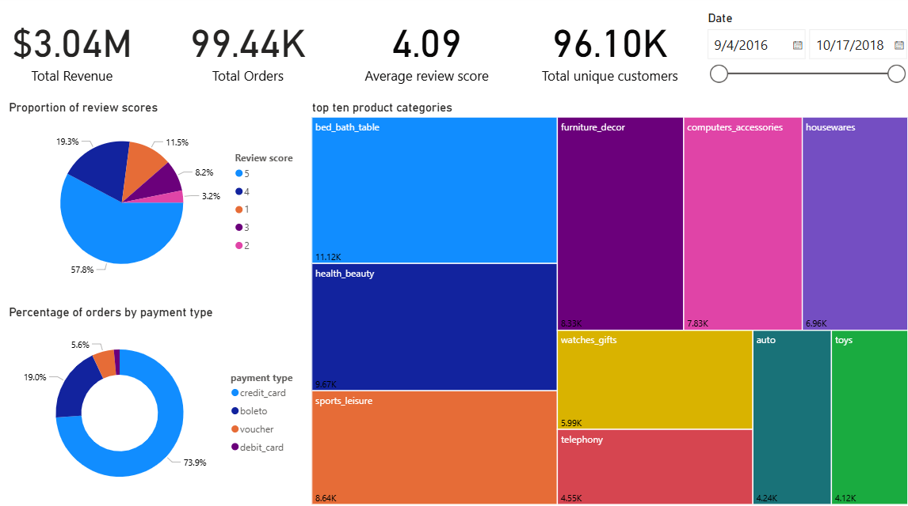
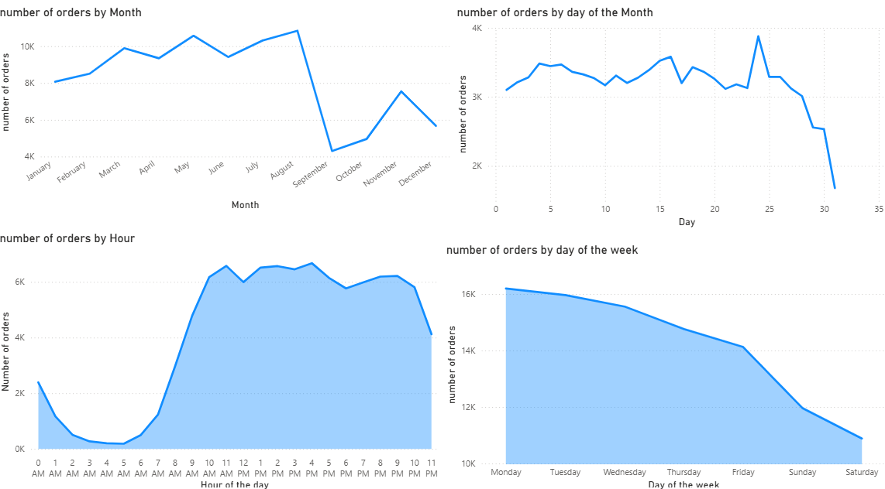
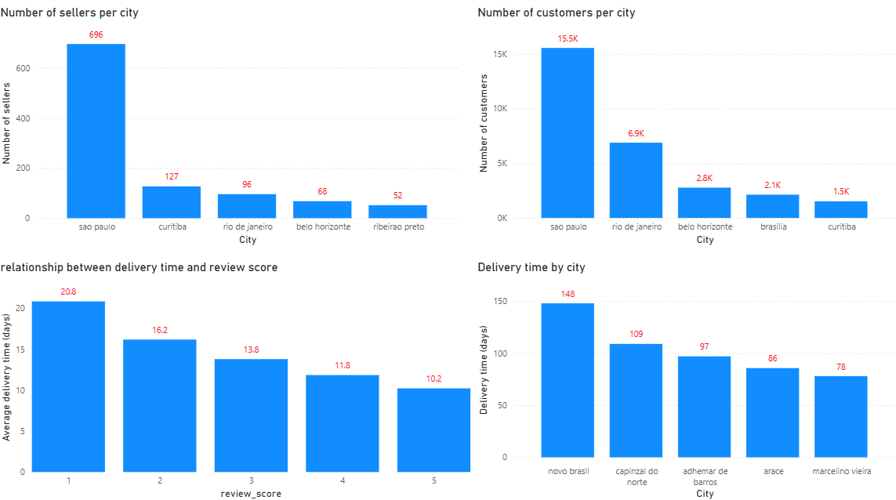

# Olist Brazilian E-Commerce Analysis

An end-to-end data analytics project analyzing 100,000+ orders from the Olist Brazilian E-Commerce dataset. The project covers the full data pipeline — from raw data cleaning in Python, through SQL analysis and data modelling, to interactive dashboards in Power BI.

---

## 🛠️ Tools Used
- **Python (Pandas)** — Data cleaning and preparation
- **MySQL** — Relational database modelling, feature engineering and analysis
- **Power BI** — Interactive dashboard development and DAX measures

---

## 🔄 Project Pipeline

### 1. Data Cleaning (Python)
- Handled null values and missing data
- Fixed data types and formatting inconsistencies
- Prepared all tables for loading into MySQL

### 2. SQL Analysis (MySQL)
- Assigned primary and foreign keys across 6 tables
- Engineered new columns including:
  - Delivery time (days)
  - Review response time (hours and days)
  - Order hour and day of week
  - Currency conversion from BRL to USD
- Wrote 25+ analytical queries across orders, customers, sellers, payments, products and reviews

### 3. Power BI Dashboards
Built 3 interactive dashboards connected to the MySQL data model:
- **Overview** — Revenue KPIs, top product categories, review score distribution, payment type breakdown
- **Trend Analysis** — Order patterns by month, day of week, day of month and hour of day
- **Operations & Geography** — Seller and customer distribution by city, delivery time by city, delivery time vs review score

---

## 📊 Key Insights

- 🚚 **Delivery time directly impacts customer satisfaction** — customers who gave 1-star reviews experienced an average delivery time of **20.8 days** vs **10.2 days** for 5-star reviews, a 2x difference
- 📅 **Monday is the busiest order day** and Saturday is the quietest
- 🕙 **Orders peak between 10 AM and 9 PM** with a sharp drop in the early morning hours
- 🏙️ **Sao Paulo dominates** with 696 sellers and 15.5K customers — far ahead of any other city
- 💳 **Credit card accounts for 73.9%** of all payments
- 🛍️ **Bed, bath & table** and **health & beauty** are the top performing categories by order volume
- 💰 **Total revenue of $3.04M** across 99.44K orders and 96.1K unique customers

---

## 📁 File Structure

```
├── data/                        # Raw datasets downloaded from Kaggle
│   ├── customers.csv
│   ├── orders.csv
│   ├── order_items.csv
│   ├── payments.csv
│   ├── products.csv
│   ├── reviews.csv
│   ├── sellers.csv
│   └── product_category_name_translation.csv  # Used as reference during cleaning
│
├── clean-data/                  # Cleaned datasets ready for MySQL import
│   ├── customers_clean.csv
│   ├── orders_clean.csv
│   ├── order_items_clean.csv
│   ├── payments_clean.csv
│   ├── products_clean.csv
│   ├── reviews_clean.csv
│   └── sellers_clean.csv
│
├── notebooks/                   # Python data cleaning
│   └── clean.ipynb              # Cleaning and preparation notebook
│
├── sql scripts/                 # MySQL scripts
│   ├── adding_keys.sql          # Primary and foreign key setup
│   ├── adding_columns.sql       # Feature engineering queries
│   ├── orders_analysis.sql      # Order trends and patterns
│   ├── customer_analysis.sql    # Customer behaviour analysis
│   ├── seller_analysis.sql      # Seller performance analysis
│   ├── product_analysis.sql     # Product category analysis
│   ├── payments_analysis.sql    # Payment and revenue analysis
│   └── review_analysis.sql      # Review score analysis
│
└── Visualizations/              # Power BI dashboard files
```

---

## 📸 Dashboard Screenshots

### Overview


### Trend Analysis


### Operations & Geography


---

## 📂 Dataset
The dataset used is the [Olist Brazilian E-Commerce Public Dataset](https://www.kaggle.com/datasets/olistbr/brazilian-ecommerce) available on Kaggle.
